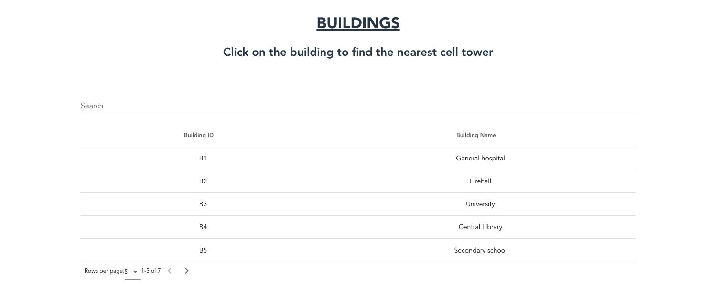
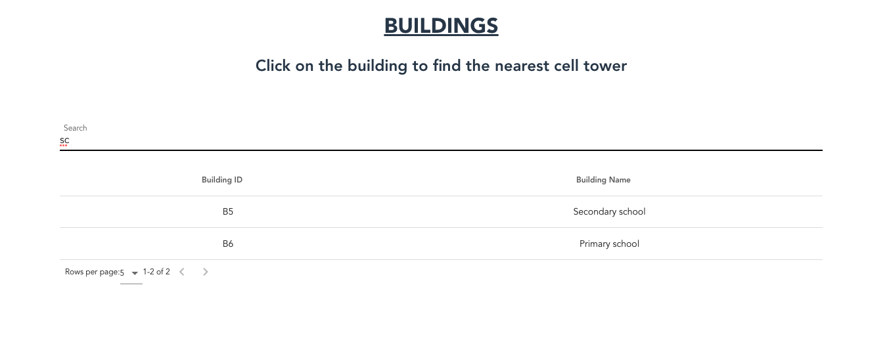
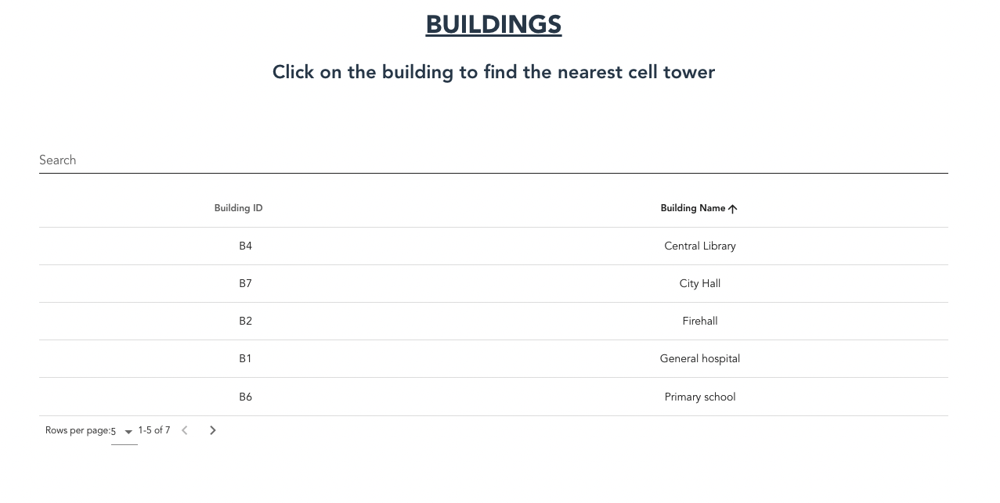
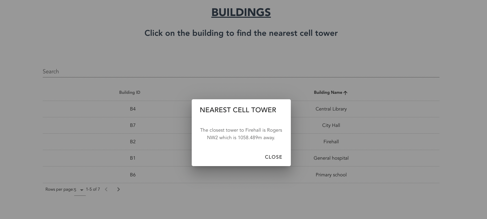

# Nearest Cell Tower

 The City of Futurpruf is evaluating the cell phone coverage for key buildings in the community by evaluating the distance to the nearest cell tower. This requires a web application that, for a given set of buildings and a set of cell towers in a city, and the x-y coordinates of each, allows the user to specify a building, and return the nearest cell tower to that building.

 ## How to run

 ### Backend

 * Make sure your Docker Desktop is running.
 * Run the follwing commands in your terminal.
 ``` 
 cd backend 
./build.sh
./deploy.sh
  ```

 * You can access swagger on http://localhost:3000/api-docs/


 ### Frontend

 * Make sure your Docker Desktop is running.
 * Run the follwing commands in your terminal.
 ``` 
 cd frontend/nearest_cell_tower 
./build.sh
./deploy.sh
  ```
* You should have backend running on http://localhost:8080

## Tech stack

### Backend 
* Node js
* Express

### Frontend
* Vue js
* Vuetify

### Deployment
* Docker
* Shell scripts

## Screenshots

### Display buildings

### Filter feature

### Sorting feature

### Onclick Modal to show nearest tower

